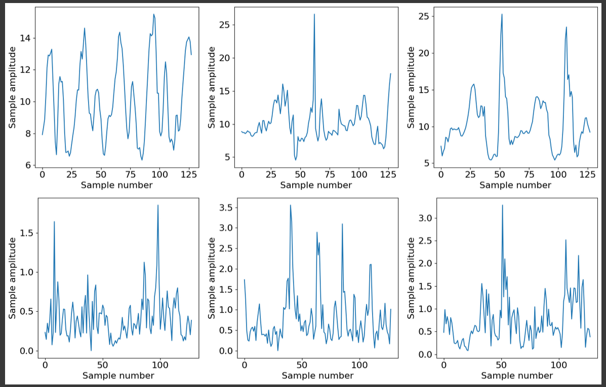
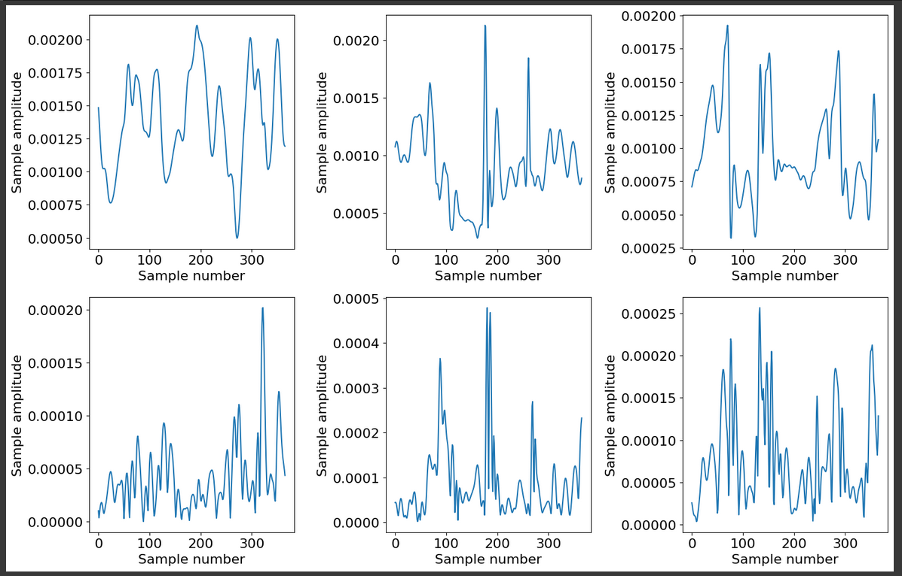
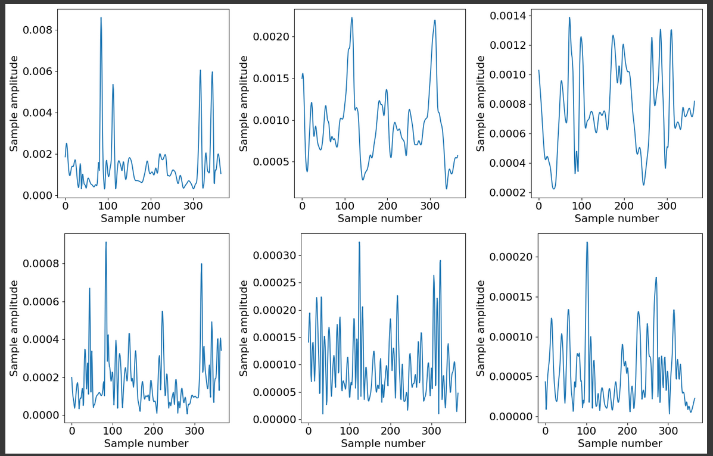

# WALK ON: GAIT RECOGNITION IN-THE-WILD

## Introduction

With the growing use of technology in modern days, it is rare to see someone who doesn't carry a piece of it nowadays.

Either if it is a cellphone or a smartwatch, these devices have a lot of sensors that allow them to capture information regarding the outside world and how the user interacts with it.

This gait information can later be used to identify the activity of a user during a certain period of time or even identify a user itself.

Using deep learning based techniques it is possible to achieve these objectives using gait information like accelerometer, gyroscope, image capturing, videos, etc...

## Objective

The objective of this project is, therefore, to develop a deep learning technique that is capable of identifying individuals given their gait information collected from their
mobile devices (accelerometer and gyroscope).

These methods could be used for a variety of purposes and different techniques will be used in order to study which one better fits each type of purpose and each type of data.

### Purposes

During the development of the project the following purposes will be kept in mind:

- Identifying if the individual carrying the device is the usual user (in case of stealing);

- Authentication of an individual in restricted areas (if the information transmitted by their smart phone corresponds to some authorized individual).

## Feature Analysis

In order to achieve these goals, a few datasets were considered, in order to perceive how different type of collected information can affect the identification of the users.

In the real world, most of the information is noisy and incomplete and, therefore, it is not possible to assume that optimal samples will always be available.

Both optimal and suboptimal information will be used in order to better understand how the values correlate.

### Datasets

The considered datasets are provided by [1], which is a study with similar goals to the ones considered in this project.

The first and second datasets provide perfect information. They come divided in samples of two steps (which by [1] are consireded optimal for user identification) which correspond to some user.

The third and forth datasets provide imperfect real information. They are divided in samples of 2.56 seconds collected from the devices from each individual.

The first and third datasets provide information on 118 subjects, using sample overlap to extend the dataset (sample might have moments from other samples), while the other two datasets provide information on 20 subjects, but unique samples (no overlaps).

## Feature Treatment

As the information provided by the datasets already has a good treatment level (only including the steps and being in a small time frame), the treatment done will have the objectives of adapting the information to the goals of the project and of trying to improve the performance of the models.

A series of procedures will be done and studied individually in order to better understand their necessity and how they adapt to the goal.

### Signal Pre-Processing

The first procedure will be to pre process the signal. This consits of an upsampling and a filtering of the sample in order to better recognize the steps and eliminate noise.

This step is not required for the samples of the first two datasets since they are already only two steps, but might be useful for the other two datasets since they are captured in a fixed-time length.

### Step Exctraction

This second procedure will only be applied to the first two datasets.

The goal of this exctraction is to evaluate ether single step user identification is feasable, since it is easier to exctract single steps from more smaller and limited samples than two consecutive steps.

### Reference System Normalization

Even though all of the samples displayed in these datasets are captured by the same device per individual, it might not always be the case in future evaluations.

It might be required to identify an individual whose gait information is only known from previous devices and, therefore, training the models with a normalized reference system will provide information for situations where that might happen.

This procedure, therefore, intends to normalize every sample into a common reference system.

### Sample Normalization

This last step is not so relevant for data alteration, it only is necessary to uniformize the data previously treated in order for it to be ready to be fed into the learning models.

Every sample will be translated into a 200 frame sample and, in case of, steps will be rejoined or separated into different samples in order to test the different model performances.

## Neural Network Models

Given the data treatment procedures, all is left is defining models for identifying users.

Three models were considered for the goals of this project:

- CNN - Convolutional Neural Network - good at identifying patterns in fixed samples

- LSTM - Long Short-Term Memory Neural Network - good at identifying time patterns in time derived samples

- CNN + LSTM - a cojoined network based on the previous two.

The first performance results acquired on the training were based on a 50 Epoch and 32 Batch-Size approach, but were switch to a 20/30 Epoch and 32 Batch-Size approach, due to similar performance and time constraints.

The choice of models for the study of this project was inspired by the methods described for user classification in [1].

---

[1] Zou Q, Wang Y, Zhao Y, Wang Q and Li Q, Deep learning-based gait recogntion using smartphones in the wild, IEEE Transactions on Information Forensics and Security, vol. 15, no. 1, pp. 3197-3212, 2020.

## Results

### Step-Interpolated Datasets

#### CNN Model

| Treatment | Dataset 1 Accuracy | Dataset 1 Loss | Dataset 2 Accuracy | Dataset 2 Loss |
|-|-|-|-|-|
| No Treatment | 0.9388 | 0.7136 | 0.9708 | 0.5053 |
| Faster Training | 0.9318 | 0.8552 | 0.9698 | 0.4895 |
| Normalization of Steps | 0.9005 | 0.7019 | 0.9611 | 0.4568 |
| Normalization of Separated Steps | 0.8896 | 0.5894 | 0.9537 | 0.2666 |

#### LSTM Model

| Treatment | Dataset 1 Accuracy | Dataset 1 Loss | Dataset 2 Accuracy | Dataset 2 Loss |
|-|-|-|-|-|
| No Treatment | 0.9249 | 0.9446 | 0.9724 | 0.3117 |
| Faster Training | 0.9155 | 0.7015 | 0.9670 | 0.3093 |
| Normalization of Steps | 0.8636 | 0.7713 | 0.9483 | 0.3543 |
| Normalization of Separated Steps | 0.8695 | 0.7421 | 0.9520 | 0.3568 |

#### CNN + LSTM Model

| Treatment | Dataset 1 Accuracy | Dataset 1 Loss | Dataset 2 Accuracy | Dataset 2 Loss |
|-|-|-|-|-|
| No Treatment | 0.9374 | 1.0442 | 0.9729 | 0.3273 |
| Faster Training | 0.9257 | 1.0442 | 0.9702 | 0.4799 |
| Normalization of Steps | 0.8971 | 0.9278 | 0.9568 | 0.9161 |
| Normalization of Separated Steps | 0.8965 | 0.7894 | 0.9553 | 0.4182 |

### Fixed Time-Length Datasets

#### CNN Model

| Treatment | Dataset 3 Accuracy | Dataset 3 Loss | Dataset 4 Accuracy | Dataset 4 Loss |
|-|-|-|-|-|
| No Treatment | 0.9301 | 0.7101 | 0.9830 | 0.1671 |
| Faster Training | 0.9281 | 0.7886 | 0.9696 | 0.3472 |
| Pre-Process | 0.8863 | 1.2390 | 0.9635 | 0.5361 |
| Normalization | 0.9154 | 0.6223 | 0.9810 | 0.1402 |

#### LSTM Model

| Treatment | Dataset 3 Accuracy | Dataset 3 Loss | Dataset 4 Accuracy | Dataset 4 Loss |
|-|-|-|-|-|
| No Treatment | 0.9311 | 0.7141 | 0.9690 | 0.3178 |
| Faster Training | 0.9238 | 0.6131 | 0.9668 | 0.2504 |
| Pre-Process | 0.8964 | 0.7711 | 0.9556 | 0.3037 |
| Normalization | 0.9074 | 0.5997 | 0.9701 | 0.1431 |

#### CNN + LSTM Model

| Treatment | Dataset 3 Accuracy | Dataset 3 Loss | Dataset 4 Accuracy | Dataset 4 Loss |
|-|-|-|-|-|
| No Treatment | 0.9328 | 1.0914 | 0.9696 | 0.3943 |
| Faster Training | 0.9281 | 0.9809 | 0.9711 | 0.3416 |
| Pre-Process | - | - | 0.9584 | 0.5478 |
| Normalization | 0.9214 | 0.6747 | 0.9802 | 0.1604 |

### Evaluation

Examining all the performance results, it is possible to come up with some conclusions that justify what was obtained. Even though some accuracy results were lower than other, all the results should be considered, as they have different implications in different scenarios.

The base results for comparison are the ones where data was not treated at all, as it was refered above, the data presented was already pretty clean and usable for training. These results were obtained with the 50 epochs of training and a batch size of 32 samples.

#### Faster Training

Due to time constraints and analysis of training, it was prefered to diminute the epochs of training in order to obtain all desired results for analysis.

For the first two datasets, the training was reduced to 20 epochs and for the second two reduced to 30 epochs.

The first two datasets' data is better treated than the second ones, requiring the neural networks less epochs to learn its patterns.

As seen in the table of results, this diminution of epochs barely affects the performance of models and it is much more viable to train the large quantity of desired models.

#### The Pre-Processing Problem

Regarding only the second two datasets, a first trial of only pre-processing of data was performed in order to evaluate how this treatment would affect the models.

For both datasets the results were very different. In the first one, it dropped the performance considerably (not even being necessary to test the cnn+lstm model), while in the second one, it barely affected the performance (even though the loss got slightly worse).

As refered before, the provided samples are very small and already very well treated, by applying the noise filter a lot of the information is lost and very few differences are noticable on the signal.

While the second dataset can bear with some information loss (since there is no overlap), the first one can't (since there is overlap), losing a lot of important information that the model could use to learn.

No treatment - Dataset 3

Filtered - Dataset 3

No treatment - Dataset 4

Filtered - Dataset 4

Therefore, it was decided to discard the pre-processing step in future treatment, using the raw information as base.

#### Normalization Performance

As for the normalization treatment, diverse results were obtained, some models saw their accuracy increased, while some saw decrease, but overall all the models had a better loss value and the accuracy float was very small.

Even with the small decreases in accuracy, normalization results should be considered. The datasets were captured having all the samples from a certain individual captured with the same device, which can affect the neural network, recognizing patterns in the reference system instead of the steps, which won't be useful in case of need to identify an individual starting from another device.

Besides that, the loss was generally better in the normalized samples, which means that the model was more precise (more sure) when giving correct answers, which could be benefic in future different samples.

#### Single Step vs Continuous Steps

Overall the accuracy was better with continuous steps identification, but the difference between them didn't diverge a lot. This means that single step identification is still a reliable source and could be used in case that information is the only one available.

#### Fixed Time-Length

Suprisingly, fixed time-length samples exhibited very satisfactory results diverging very little from step samples. This means that identification could be done using this kind of samples almost as reliably as using step samples, and, therefore, there isn't that much of a need to add the overhead of exctracting steps from the continuous samples.

This is probably justified with the fact that these samples were very small and contained mostly walking information, resembling almost step like samples. Obtaining these less precise samples of fixed time montion, though, is simpler than exctracting steps from samples, which benefits the overall performance.

#### Model Performance

Despite initial belief, the CNN models, overall, seemed to have had a better performance when compared with the LSTM models.

The LSTM models tend to be more appropriate for time pattern analysis, but due to the small size of the samples and lack of long continuaty in them, the CNN models seemed to have better understood the patterns, considering the samples as a single unique moment.

## Conclusion

Considering all the performance evaluations done so far and fetching the purposes initially talked about, it is feasable that the obtained models could be used to help implement the desired objectives of the refered purposes.

The models trained without any data treatment are perfectly usable to identify if the carrier of a device is its original user, since the reference system will always be that of the device.

The models trained with normalized data treatment can be used to identify users in any enviroment as their performance little differ from the ones obtained by the models trained without treatment.

## Future Perspective

The results of this project can be considered as sastisfactory, and for future implementations some advancaments can be considered, such as:

- The use of dataset with bigger and noiser samples (implying a more delicate data treatment);
- The training of the models with more epochs (to obtain even better accuracy);
- Tuning of hyperparameters (to study if the models better recognize patterns);
- The study of the performance of other types of models.
